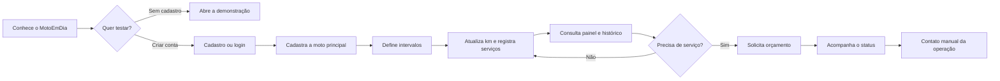
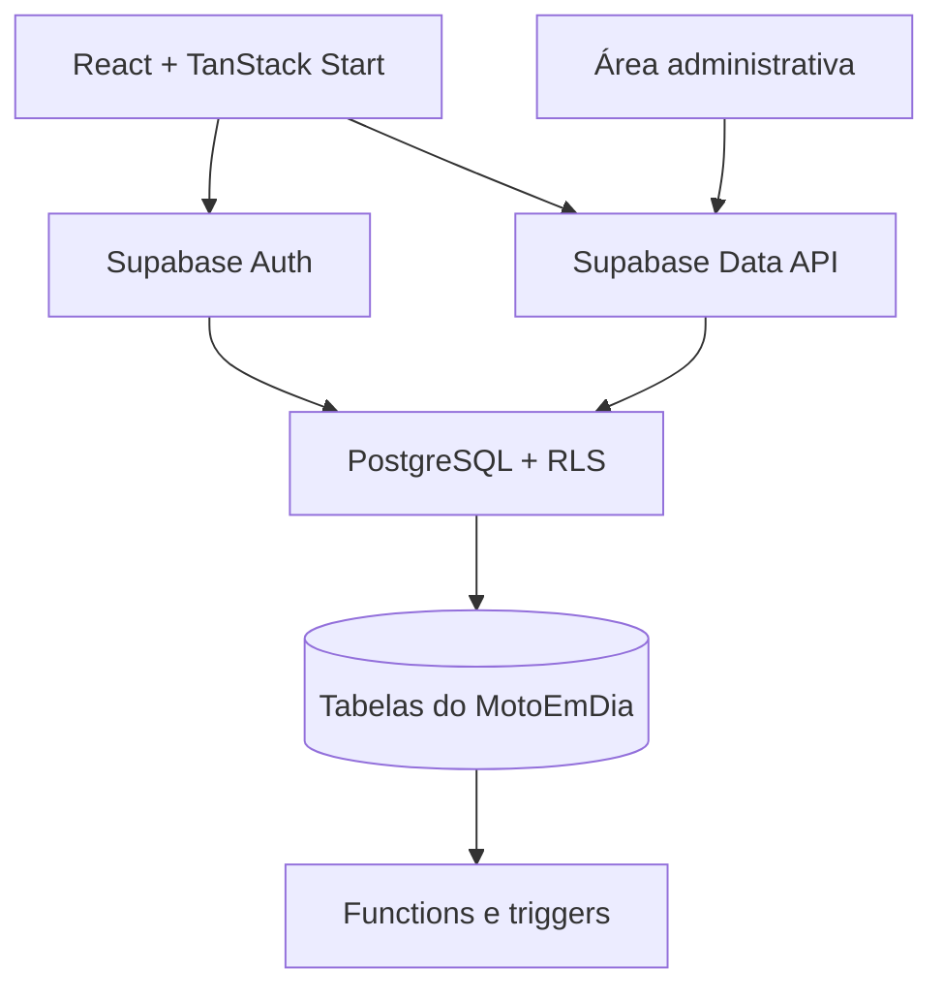

# MotoEmDia

> Um MVP para ajudar motociclistas a registrar manutenções, acompanhar a quilometragem e identificar o que merece atenção antes que a manutenção vire imprevisto.

[](https://motoemdia.lovable.app/)
[](https://motoemdia.lovable.app/demo)
[](https://github.com/spiritstonesrafa-ux/MotoEmDia)

## Visão geral

O MotoEmDia foi desenvolvido como projeto de desafio da DIO para exercitar descoberta de problema, definição de MVP, validação de hipóteses e construção assistida por inteligência artificial. O produto concentra, em uma interface responsiva, o histórico de serviços da moto, a evolução da quilometragem, intervalos definidos pelo próprio usuário e pedidos de orçamento.

O MVP não oferece diagnóstico mecânico. Seus indicadores são organizacionais e usam somente os dados informados pelo usuário; o manual da motocicleta e a avaliação de um profissional continuam sendo as referências para decisões de manutenção.

- **Aplicação:** <https://motoemdia.lovable.app/>
- **Demonstração sem cadastro:** <https://motoemdia.lovable.app/demo>
- **Código-fonte:** <https://github.com/spiritstonesrafa-ux/MotoEmDia>

## Problema

Parte dos motociclistas controla revisões por memória, anotações dispersas, conversas em aplicativos ou comprovantes que se perdem. Isso cria três dificuldades principais:

1. saber quando e em qual quilometragem um serviço foi realizado;
2. perceber quais itens estão se aproximando do intervalo definido pelo proprietário;
3. transformar a necessidade identificada em um contato organizado para orçamento.

Para oficinas, o outro lado do problema é receber contatos pouco estruturados, sem dados básicos da moto, quilometragem ou serviço desejado.

## Solução

O MotoEmDia cria um registro digital simples para a moto principal do usuário. A pessoa cadastra o veículo, atualiza a quilometragem, registra serviços e define os próprios intervalos. O painel converte essas informações em estados fáceis de entender: **OK**, **Atenção**, **Verificar** ou **Sem informações**.

Quando precisa de atendimento, o usuário envia uma solicitação estruturada. No MVP, a equipe administra o funil e continua o atendimento manualmente por WhatsApp ou ligação.

## Tese do MVP

> Se o motociclista conseguir reunir dados da moto, histórico, quilometragem e intervalos em um fluxo curto, então terá mais clareza para acompanhar a manutenção e demonstrará intenção de contratar serviços por meio de solicitações de orçamento.

O MVP procura validar três sinais antes de investir em automações mais caras:

- recorrência no registro de quilometragem e manutenções;
- utilidade percebida do painel de situação;
- conversão de necessidade de manutenção em solicitação de orçamento.

## TAM, SAM e SOM

O dimensionamento abaixo mede **unidades potenciais (motocicletas/motonetas ou usuários equivalentes)**, não faturamento. Ele é uma estimativa top-down para orientar a validação do produto; proprietários com mais de um veículo podem aparecer mais de uma vez na frota.

| Camada  | Definição e cálculo                                                                    |                                                Estimativa |
| ------- | -------------------------------------------------------------------------------------- | --------------------------------------------------------: |
| **TAM** | Frota brasileira registrada em dez/2025: 29.898.698 motocicletas + 6.665.170 motonetas |                                   **36.563.868** veículos |
| **SAM** | TAM × 90,5%, proporção da população de 10 anos ou mais que utilizou internet em 2025   | **33.090.301** veículos/usuários digitalmente alcançáveis |
| **SOM** | Cenário de aquisição em 24 meses entre 0,02% e 0,10% do SAM                            |               **6,6 mil a 33,1 mil** usuários cadastrados |

### Premissas e sensibilidade

- O TAM usa as categorias **motocicleta** e **motoneta** da SENATRAN; ciclomotores e outros tipos não entram na conta.
- O percentual de uso da internet é um **proxy**: não existe, nas fontes consultadas, o cruzamento nacional entre propriedade de motocicleta e uso de internet. O SAM pressupõe que a conectividade dos proprietários se aproxima da média da população.
- O SOM não é demanda comprovada nem previsão. É uma meta de execução para teste: cenário conservador de 0,02% (**6.618**), base de 0,05% (**16.545**) e superior de 0,10% (**33.090**) do SAM.
- Receita potencial não foi estimada porque preço, comissão, conversão e disposição a pagar ainda são hipóteses a validar.

**Fontes oficiais, consultadas em 26/09/2026:**

- [SENATRAN — Frota de Veículos 2025, planilha “Frota por UF e Tipo de Veículo”, dezembro de 2025](https://www.gov.br/transportes/pt-br/assuntos/transito/conteudo-Senatran/frota-de-veiculos-2025)
- [IBGE/PNAD Contínua TIC — proporção de usuários da internet ultrapassou 90% em 2025](https://agenciadenoticias.ibge.gov.br/agencia-noticias/2012-agencia-de-noticias/noticias/47408-proporcao-de-usuarios-da-internet-no-pais-ultrapassou-90-da-populacao-de-10-anos-ou-mais-em-2025)

## Business Model Canvas

O Canvas representa hipóteses de modelo de negócio; os mecanismos de cobrança ainda não fazem parte do MVP.

| Bloco                     | Hipótese atual                                                                                                                                             |
| ------------------------- | ---------------------------------------------------------------------------------------------------------------------------------------------------------- |
| **Segmentos de clientes** | Motociclistas que cuidam da própria rotina de manutenção; oficinas e prestadores interessados em contatos qualificados.                                    |
| **Proposta de valor**     | Para o motociclista: histórico, quilometragem e sinais de atenção em um só lugar. Para a oficina: solicitação com contexto mínimo do veículo e do serviço. |
| **Canais**                | Aplicação web, busca orgânica, comunidades de motociclistas, redes sociais, indicações e parcerias locais.                                                 |
| **Relacionamento**        | Autoatendimento no produto; suporte digital; contato humano no orçamento durante a validação.                                                              |
| **Fontes de receita**     | Hipóteses futuras: taxa por lead qualificado, plano para oficinas, recursos premium para motociclistas ou comissão sobre serviço concluído.                |
| **Recursos principais**   | Aplicação, banco de dados, regras de segurança, marca, base de histórico e rede de parceiros.                                                              |
| **Atividades principais** | Evolução do produto, aquisição e suporte, qualificação de solicitações, relacionamento com oficinas e análise do funil.                                    |
| **Parcerias principais**  | Oficinas, mecânicos, lojas de peças, comunidades de motociclistas e possíveis parceiros de mobilidade/seguro.                                              |
| **Estrutura de custos**   | Hospedagem e banco, desenvolvimento, suporte, aquisição de usuários, operação de leads e conformidade com proteção de dados.                               |

## Hipóteses de validação

As metas abaixo são critérios de aprendizado, não resultados já alcançados.

| Hipótese                               | Sinal esperado no teste                                            | Métrica inicial sugerida                                 |
| -------------------------------------- | ------------------------------------------------------------------ | -------------------------------------------------------- |
| O histórico resolve uma dor recorrente | Usuários registram um primeiro serviço pouco depois do cadastro    | ≥ 40% em até 14 dias                                     |
| O painel incentiva retorno             | Usuários atualizam quilometragem ou registram manutenção novamente | ≥ 30% em 30 dias                                         |
| Intervalos manuais são compreensíveis  | Usuários configuram ao menos uma categoria                         | ≥ 50% dos usuários ativados                              |
| Existe intenção de contratar serviço   | Usuários ativos enviam uma solicitação                             | ≥ 10% em 90 dias                                         |
| O contato tem valor para a operação    | Solicitações recebem contato e avançam no funil                    | contato em até 1 dia útil e ≥ 20% em “serviço realizado” |

## Escopo do MVP

- landing page e demonstração com dados fictícios, sem credenciais;
- cadastro, login por e-mail/senha, login com Google e recuperação de senha;
- perfil do usuário;
- cadastro e edição de uma moto principal;
- atualização de quilometragem com bloqueio de regressão no banco;
- registro, edição, exclusão e histórico de manutenções;
- intervalos de manutenção definidos pelo usuário por categoria;
- painel com situação calculada a partir da quilometragem, do último registro e do intervalo informado;
- solicitação de orçamento e acompanhamento do status;
- área administrativa com métricas, usuários, solicitações e atualização do funil;
- controle de acesso por autenticação, papéis e Row Level Security.

### Regra dos estados do painel

Quando existem registro e intervalo para uma categoria, o sistema calcula `quilometragem atual − quilometragem do último serviço`:

- até 70% do intervalo: **OK**;
- acima de 70% e até 100%: **Atenção**;
- acima de 100%: **Verificar**;
- sem registro ou sem intervalo: **Sem informações**.

Esses estados não substituem inspeção, manual ou orientação profissional.

## O que permaneceu manual

- definição dos intervalos conforme manual da moto ou orientação profissional;
- atualização da quilometragem e registro das manutenções;
- análise do pedido, contato por WhatsApp/ligação e elaboração do orçamento;
- mudança do status da solicitação pela área administrativa;
- concessão do papel de administrador por migration/backend, nunca pelo frontend;
- validação comercial com oficinas e acompanhamento da conversão.

## Fora do escopo atual

- diagnóstico mecânico, recomendação automática ou garantia de segurança do veículo;
- integração com hodômetro, telemetria, montadoras ou catálogos oficiais;
- importação automática de planos de manutenção por modelo;
- marketplace, comparação de oficinas, agenda, pagamento ou emissão fiscal;
- notificações automáticas por push, e-mail ou WhatsApp;
- anexos de notas fiscais e fotos;
- gestão de múltiplas motos na interface;
- aplicativo móvel nativo e operação offline;
- modelo de cobrança validado.

## Fluxo do usuário



## Stack

- **Frontend/full stack web:** React 19, TypeScript, TanStack Start, TanStack Router e Vite;
- **Dados e cache:** Supabase JS e TanStack Query;
- **Backend:** Supabase/PostgreSQL, Auth, Data API, migrations, funções, triggers e RLS;
- **Interface:** Tailwind CSS, Radix UI, Lucide React e Recharts;
- **Formulários e validação:** React Hook Form, Zod e Hookform Resolvers;
- **Datas e feedback:** date-fns e Sonner;
- **Construção assistida:** Lovable e ChatGPT/Codex.

## Arquitetura e banco de dados



### Modelo principal

| Tabela                  | Responsabilidade                                          |
| ----------------------- | --------------------------------------------------------- |
| `profiles`              | nome, e-mail e telefone vinculados ao usuário autenticado |
| `user_roles`            | papéis `user` e `admin` separados do perfil               |
| `motorcycles`           | dados da moto principal e quilometragem atual             |
| `mileage_updates`       | trilha das alterações de quilometragem                    |
| `maintenance_records`   | serviços, data, km, custo, oficina e observações          |
| `maintenance_intervals` | intervalo por categoria e motocicleta                     |
| `quote_requests`        | solicitação, contato, preferência e status do funil       |

`motorcycles` é a entidade central. Registros, intervalos e solicitações podem referenciar a moto; as linhas também carregam `user_id` para que as políticas de acesso filtrem o proprietário. A função `has_role` autoriza leituras administrativas, e triggers criam o perfil inicial, impedem regressão da quilometragem, registram seu histórico e normalizam o status de novas solicitações.

## Segurança

- `.env` é ignorado pelo Git; o repositório mantém apenas `.env.example` sem valores;
- chaves **secret/service role** são exclusivas de contexto servidor e nunca devem usar prefixo `VITE_`;
- o navegador usa chave publishable, que identifica o cliente, combinada com autenticação e políticas RLS;
- todas as tabelas de domínio habilitam RLS;
- operações do usuário são limitadas por `auth.uid()` e, quando aplicável, pela propriedade da moto;
- acesso administrativo consulta `user_roles` por meio de `has_role`; o papel não é inferido por e-mail no frontend;
- funções privilegiadas definem `search_path` e têm execução pública revogada quando não precisam ser chamadas pelo cliente;
- validações de formulário usam Zod, enquanto regras críticas, como a não regressão da quilometragem, também vivem no banco.

Referências: [API keys](https://supabase.com/docs/guides/getting-started/api-keys) e [segurança de dados](https://supabase.com/docs/guides/database/secure-data) na documentação oficial do Supabase.

## Uso de IA, Lovable e ChatGPT

O projeto adotou IA como acelerador de produto e engenharia, mantendo revisão humana das decisões:

- **Lovable:** geração e evolução da interface, integração com o backend, publicação do app e sincronização com o GitHub;
- **ChatGPT/Codex:** estruturação do problema, tese e hipóteses, análise de escopo, pesquisa de fontes oficiais, revisão de segurança e documentação da entrega;
- **Responsabilidade humana:** priorização do MVP, conferência do código, validação das regras, testes e decisão sobre o que publicar.

<details>
<summary>Exemplo do mega prompt que orienta o MVP</summary>

> Crie uma aplicação web responsiva chamada MotoEmDia para motociclistas registrarem sua moto principal, quilometragem, manutenções e intervalos definidos por eles mesmos. Mostre estados simples de atenção sem oferecer diagnóstico mecânico. Permita solicitar orçamento e acompanhar o status. Inclua autenticação, área administrativa, banco PostgreSQL/Supabase e RLS para que cada usuário veja apenas seus dados, enquanto administradores acessem métricas e solicitações. Use dados fictícios somente na rota de demonstração e mantenha decisões críticas de autorização no banco.

</details>

## Decisões de produto

1. **Intervalos não vêm preenchidos.** Modelos, uso e recomendações variam; o usuário deve consultar o manual ou um profissional.
2. **Uma moto principal reduz o onboarding.** Gestão de múltiplos veículos fica para uma etapa posterior à validação de recorrência.
3. **O painel é explicável.** Faixas simples de 70% e 100% tornam o cálculo auditável e evitam uma falsa sensação de inteligência mecânica.
4. **Orçamento começa como concierge.** O pedido é estruturado no produto, mas contato e execução permanecem humanos para aprender antes de automatizar.
5. **Segurança fica no banco.** A interface melhora a experiência, mas RLS, ownership e papéis são a barreira efetiva de acesso.
6. **Administração não depende de e-mail no cliente.** O papel é registrado em `user_roles` por processo controlado.
7. **Demo é isolada.** A rota `/demo` usa constantes locais e não grava dados fictícios no banco de produção.

## Homologação

Verificações técnicas executadas em 26/09/2026:

| Verificação             | Critério                                                                                                                                                                  |
| ----------------------- | ------------------------------------------------------------------------------------------------------------------------------------------------------------------------- |
| Aplicação pública       | rota `/` responde HTTP 200                                                                                                                                                |
| Demonstração            | rota `/demo` responde HTTP 200 sem exigir credenciais                                                                                                                     |
| Higiene de configuração | `.env` não rastreado e `.env.example` sem valores                                                                                                                         |
| Qualidade estática      | `npm run lint` executado; falha por incompatibilidade preexistente entre CRLF e a regra LF do Prettier nos arquivos do projeto. Nenhum código foi alterado nesta entrega. |
| Build de produção       | `npm run build` concluído com sucesso                                                                                                                                     |

Roteiro funcional recomendado para cada release:

- criar conta, confirmar e-mail, entrar, sair e recuperar senha;
- cadastrar/editar a moto e rejeitar quilometragem inferior à atual;
- criar, editar e excluir uma manutenção;
- definir intervalos e conferir os quatro estados do painel;
- enviar solicitação e acompanhar seu status como usuário;
- validar bloqueio das rotas administrativas para usuário comum;
- como administrador, consultar métricas/usuários e avançar o status de uma solicitação;
- conferir responsividade, estados vazios, carregamento e mensagens de erro.

## Executando localmente

Pré-requisitos: Node.js e um projeto Supabase compatível com as migrations deste repositório.

```bash
git clone https://github.com/spiritstonesrafa-ux/MotoEmDia.git
cd MotoEmDia
cp .env.example .env
npm install
npm run dev
```

Preencha apenas o `.env` local. As variáveis `VITE_SUPABASE_URL` e `VITE_SUPABASE_PUBLISHABLE_KEY` chegam ao navegador e devem conter somente valores públicos. `SUPABASE_SERVICE_ROLE_KEY`, quando necessária em handlers de servidor, deve permanecer secreta e nunca ser exposta no bundle.

Comandos úteis:

```bash
npm run lint
npm run build
npm run preview
```

## Próximos passos

1. executar entrevistas e testes de usabilidade com motociclistas;
2. instrumentar ativação, retorno, registro de manutenção e conversão de orçamento;
3. validar o funil manual com oficinas e medir tempo de contato e serviço realizado;
4. testar lembretes opt-in sem transformar intervalos em recomendação mecânica;
5. evoluir para múltiplas motos somente após confirmar demanda;
6. estudar catálogo de intervalos oficiais por fabricante/modelo, sempre com fonte e aviso claros;
7. adicionar anexos e exportação do histórico;
8. definir política de privacidade, retenção e exclusão de dados para operação em escala;
9. validar disposição a pagar e escolher um modelo de receita;
10. ampliar testes automatizados, observabilidade e revisão periódica das políticas RLS.

---

Projeto desenvolvido para fins de aprendizagem, experimentação e validação de produto no desafio DIO.
